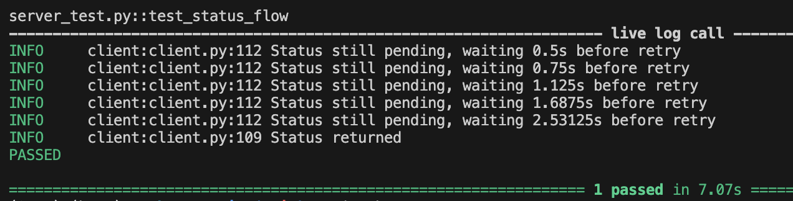

# Status check client library

## Intro
This is a small Python client library that checks a Flask server's status with the request `GET /status`, which is implemented with exponential backoff polling to help customer get status fast without incurring too much server traffic. Tentatively, an optional callback could further cut down wait time.   And the response is in the format of `{“result”: “pending” or “error” or “completed”}`. 

## Instruction
`pip install -r requirements.txt` to install the dependencies needed. 

`pytest --log-cli-level=INFO` to run the integration test that spins up server and demonstrate status check using the client library.  
Logs will be printed as below

